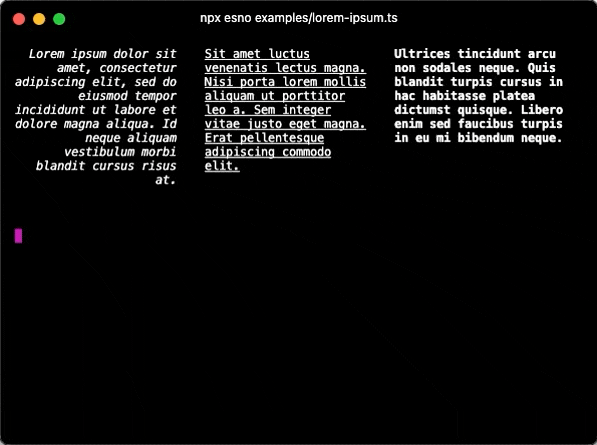

# terminal-columns <!-- <a href="https://npm.im/terminal-columns"></a> <a href="https://npm.im/terminal-columns"></a> <a href="https://packagephobia.now.sh/result?p=terminal-columns"></a> -->

Readable tables for the terminal.

<p align="center">
    
    <br>
    <em>Tables can be automatically responsive!</em>
</p>

### Features
- Content wrapped to fit column width
- Column widths `auto`, `content-width`, viewport percents & static values
- Align left & right
- Horizontal & vertical padding
- Rows can overflow into multiple rows
- Easy to make responsive tables

→ [Try it out online](https://stackblitz.com/edit/terminal-columns-demo?devtoolsheight=50&file=examples/responsive-table.js&view=editor)

<sub>Support this project by ⭐️ starring and sharing it. [Follow me](https://github.com/privatenumber) to see what other cool projects I'm working on! ❤️</sub>

## 🚀 Install

```bash
npm i terminal-columns
```

## 🚦 Quick start
Render a table by passing table data into `terminal-columns` and writing it to stdout.

```ts
import terminalColumns from 'terminal-columns'

// Create table data
const tableData = [
    ['Cell A1', 'Cell B1', 'Cell C1'],
    ['Cell A2', 'Cell B2', 'Cell C2'],
    ['Cell A3', 'Cell B3', 'Cell C3']
]

// Render table
const tableString = terminalColumns(tableData)
console.log(tableString)
```

By default, the columns will be rendered with the `auto` width, which splits the available width with other `auto` columns. To configure the width of each column, pass them in as the second argument.

```ts
const tableString = terminalColumns(
    tableData,

    // Configure column widths
    [
        'content-width', // Use the width of the content
        '50%', // Fill 50% of viewport width
        'auto' // Fill remaining width
    ]
)
```

## 📖 Examples

### Fixed width table
You can set a fixed width for each column by passing in a the number of columns.

However, note that this will wrap the row to the next line if the viewport width is smaller than the table width.

```ts
terminalColumns(
    tableData,
    [
        30,
        30,
        30
    ]
)
```

### Fixed width table with no row-wrapping
You can change the row-wrapping behavior by telling terminal-columns to use a different viewport width via the `stdoutColumns` option. For example, passing in `Infinity` will trick it into thinking the table is never overflowing the viewport width.

```ts
terminalColumns(
    tableData,
    {
        stdoutColumns: Number.POSITIVE_INFINITY,
        columns: [
            30,
            30,
            30
        ]
    }
)
```

### Padding
You can add padding to each column by setting `paddingLeft`, `paddingRight`, `paddingTop`, or `paddingBottom` on the column.

```ts
terminalColumns(
    tableData,
    [
        {
            paddingLeft: 2 // Pad the left side of the cell with 2 spaces
        },
        {
            paddingRight: 2 // Pad the right side of the cell with 2 spaces
        },
        {
            paddingTop: 2 // Pad the top of the cell with 2 lines
        },
        {
            paddingBottom: 2 // Pad the bottom of the cell with 2 lines
        }
    ]
)
```

### Right align text
You can align the content of the column by setting `align: 'right'`.

```ts
terminalColumns(
    tableData,
    [
        {
            align: 'right'
        }
    ]
)
```

### Responsive table with breakpoints function
Define breakpoints declaratively with the `breakpoints` function.

```ts
import terminalColumns, { breakpoints } from 'terminal-columns'

terminalColumns(
    tableData,
    breakpoints({
        // Large screens
        '>= 90': ['content-width', 'auto'],

        // Small screens
        '>= 25': ['100%', '100%'],

        // Tiny screens - remove responsiveness
        '>= 0': {
            columns: ['content-width', 'content-width'],
            stdoutColumns: Number.POSITIVE_INFINITY
        }
    })
)
```

### Preprocess / Postprocess
Preprocessing and postprocessing can be used to modify the table data before it is rendered. It's primarily designed for formatting purposes and can be useful to style text in a declarative manner.

In this example, the first column spans the entire screen and is transformed to be uppercase on screens smaller than 80 columns.

```ts
terminalColumns(
    tableData,
    breakpoints({
        // Small screens
        '< 80': [
            {
                width: '100%',
                preprocess: text => text.toUpperCase()
            },
            '100%'
        ]
    })
)
```

### Responsive table with custom function
You can make the table responsive by passing in a function that computes the column width allocation based on the detected viewport width.

For a working example, see [this example](/examples/responsive-table.ts).

```ts
terminalColumns(
    tableData,
    (stdoutColumns) => {
        /**
         * For large viewports
         * Split screen automatically
         */
        if (stdoutColumns > 100) {
            return [
                {
                    width: 'auto',
                    paddingRight: 1
                },
                {
                    width: 'auto'
                }
            ]
        }

        /**
         * For medium viewports
         * Break table row into two rows, and add vertical padding to create
         * a divider between rows
         */
        if (stdoutColumns > 30) {
            return [
                {
                    width: '100%'
                },
                {
                    width: '100%',
                    paddingBottom: 1
                }
            ]
        }

        /**
         * For viewports smaller than or equal to 30 columns
         * In this case, the screen is too small to render anything.
         * Simply remove responsiveness and assume the viewport width
         * is actually 1000 columns.
         */
        return {
            // Remove responsiveness
            stdoutColumns: 1000,
            columns: [
                {
                    width: 'content-width',
                    paddingRight: 1
                },
                {
                    width: 'content-width'
                }
            ]
        }
    }
)
```


## ⚙️ API

### terminalColumns(tableData, options?)
Return type: `string`

Takes in table data and outputs a string that represents the table within the current terminal width (`process.stdout.columns`).

#### tableData
Type: `string[][]`

Required

A nested array where the first-level are "rows", and the second-level are "columns".

#### options
Type: `OptionsObject | (stdoutColumns: number) => OptionsObject | ColumnMetasArray`

Schema:
```ts
type Options = OptionsObject | OptionsFunction

type OptionsObject = ColumnMetasArray | {
    columns: ColumnMetasArray
    stdoutColumns?: number
}

type OptionsFunction = (stdoutColumns: number) => OptionsObject

type ColumnMetasArray = (ColumnWidth | ColumnMeta)[]

type ColumnWidth = number | 'content-width' | 'auto' | string

type ColumnMeta = {
    width: ColumnWidth
    paddingRight?: number
    paddingLeft?: number
    paddingTop?: number
    paddingBottom?: number
    align?: 'left' | 'right'
}
```

Options to define the column widths (default is `auto`) and the stdout columns to use.

#### stdoutColumns
Type: `number`

Default: `process.stdout.columns`

The number of columns in the terminal. Autodetected by default. This is used to calculate the max-width of the table and can be overriden to force a specific width.
#### columns

Type: `Object`

##### width
Type: `number | 'content-width' | 'auto' | string`

- `number`: number of columns to span
- `'content-width'`: The width of the content in the column
- `'auto'`: Allocate the remaining width of the row to the column
- `string`: Percentage of the viewport width to use (e.g. `'50%'`)

For all of these values, the max width is `stdoutColumns`.


##### paddingLeft
Type: `number`

How many spaces to the left the column should have

##### paddingRight
Type: `number`

How many spaces to the right the column should have

##### paddingTop
Type: `number`

How many new lines to the top the column should have

##### paddingBottom
Type: `number`

How many new lines to the bottom the column should have

##### align
Type: `'left' | 'right'`

Default: `'left'`

Whether to align the text to the left or right.

##### preprocess
Type: `(cellValue: string) => string`

Function to preprocess the cell value before it is wrapped to the column width.

##### postprocess
Type: `(line: string, lineNumber: number) => string`

Function to postprocess the individual lines of a cell after it has been wrapped to the column width.

### breakpoints(breakpointsMap)

A function to declaratively define breakpoints. Returns a function pass into terminal-columns.

#### breakpointsMap

Type: `Record<string, Options>`

An object mapping breakpoints to options. The key must be in the format: `<operator> <stdout-columns>`. For example, `>= 90` will match if the terminal width is 90 or more.
